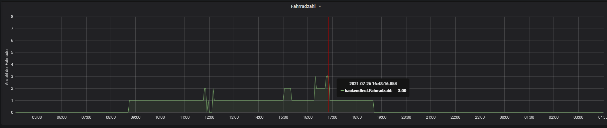

# Visualisierung

Grafana ist ein Visualisierungstool zur grafischen Darstellung von Daten aus der InfluxDB bzw. loradata.db. Sobald ein Node erfolgreich in der Datenbank angelegt wurde, ist es möglich in Grafana
mittels einer vereinfachten Datenbankabfrage die gesendeten Daten grafisch darzustellen.
Erfolgreich angelegt heißt, dass der Sensor mindestens einmal Daten im richtigen Format
gesendet hat. Es gibt verschiedene Möglichkeiten sich die Daten anzeigen zu lassen: Diagramm, Tabelle, Liste etc. Je nach Art der Daten kann die Darstellung umgestellt werden.

Nach der Auswertung der Fahrradständermessdaten, können diese ebenfalls in Grafana visualisiert werden. Im folgenden Bild ist eine Beispielmessung in einem Graphen dargestellt.

Auf der X-Achse ist die Uhrzeit und auf der Y-Achse die Anzahl der abgestellten Fahrräder zum jeweiligen Zeitpunkt zu sehen (in der link:../Auswertung[Auswertung] zusammenaddierte einzelne Stellplätze). Sobald ein Fahrrad also hingestellt wird, gibt es einen positiven und wenn ein Fahrrad herausgenommen wird, einen negativen Sprung im Graphen. Zum markierten Zeitpunkt am 26.07.2021 um 16:48 Uhr stehen also gerade 3 Fahrräder im Fahrradständer drin.