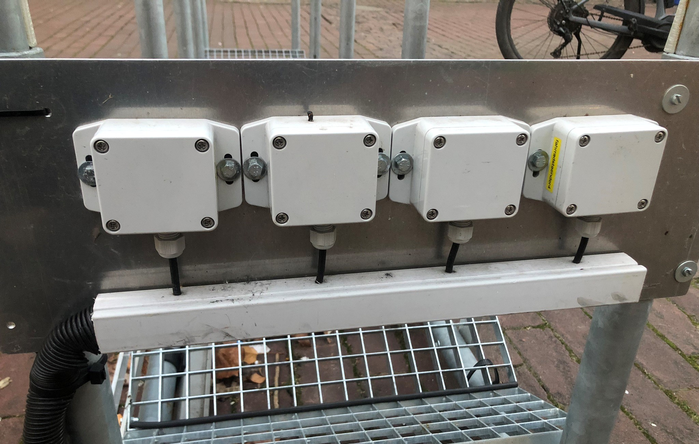

# Aufbau

Der Aufbau des Prototyps basiert auf einen handelsüblichen Bügelständer mit 5 Bügeln. Konstruktiv hinzugefügt wurden alle weiteren Komponenten, die in der link:..[Gerätebeschreibung] aufgezählt sind. Im folgenden Bild ist zunächst der Aufbau der Stellplätze dargestellt.

In einem von 4 Abteilen sind 4 auf Maß zugeschnittene Gitterroste platziert. Angeordnet in der Form eines W's lassen sich somit 2 Stellplätze realisieren in denen Fahrräder mit ihrem Vorderrad abgestellt werden können. Die nach unten zuspitzende Form sorgt dafür, dass das Rad in der Mitte steht und somit die Druckschaltleisten (Drucksensoren) auslösen kann. Um alle Freiheitsgrade der Gitterroste einzuschränken, werden sie auf einer Seite an zwei Aluminium-Flachstangen mit 8 M4 Innensechskantschrauben befestigt. Aufgrund der sehr unpräzisen Fertigung der Bauteile, werden auf der gegenüberliegenden Seite Kabelbinder und Aluminium-Stützgabeln benötigt, um die Gitterroste in ihrer Position zu stabilisieren.

Wie im Bild zu sehen, werden alle Sensorkabel um das untere Rohr des Bügeständers in einen Kabelkanal geleitet und darin mit den 4-adrigen Verlängerungsleitungen verlötet. Jeder Stellplatz erhält mit jeweils zwei Sensoren eine 4-adrige Leitung, die anschließend bis zu den Sensor-LoRa-Boxen führt. Der Kabelkanal ist mit 3D-gedruckten Klipsern innen am Rohr haftend befestigt.

In einem Kabelschutzschlauch werden die 4 Kabel aus dem Kabelkanal zur LoRa-Box geführt. Mit 3D-gedruckten Klemmen wird eine Aluminiumplatte an einem außenstehenden Bügel verschraubt, wo anschließend die LoRa-Boxen der Firma Elsys mit Sechskantschrauben befestigt werden. In jeder dieser 4 Boxen werden zwei Sensoren angeschlossen (s. folgendes Bild).

(Bild von offener LoRa-Box)

# Inbetriebnahme

Nachdem ein geeigneter Standort in Absprache mit der Mobilitätsabteilung, unter Berücksichtigung der Vorgaben für Flucht- und Rettungswege, gefunden wurde, kann die Montage beginnen. Dafür wird der Fahrradständer mit Bolzenanker fest im Boden verschraubt (s. folgende Bilder).

Die Inbetriebnahme der Boxen sollte in der Reihenfolge von rechts nach links erfolgen (von Box 4 nach Box 1). Die Begründung dafür ist wie folgt. Es werden insgesamt vier LoRa-Sensorboxen verwendet, die jeweils zwei Analogeingänge besitzen. Damit lassen sich alle 8 Stellplätze abdecken. Die Signale der Druckschaltleisten werden verarbeitet und als Messwerte über das LoRaWAN an das Backend der THU versendet. In der Auswertung im Backend werden die Messdaten der Boxen 2 bis 4 in Node Red an die erste Box gesendet, wo sie aufaddiert werden und somit zusammen mit der Zählung der ersten Box eine gesamte Fahrradzahl ergeben und im Visualisierungstool Grafana angezeigt werden kann. Aus diesem Grund ist es wichtig, dass die Boxen 2 bis 4 zuerst senden und Box 1 zuletzt. *Die Datenverarbeitung bezieht sich auf das interne Backend der THU vor der Nutzung von Azure als Backend-Lösung*.

Die Inbetriebnahme und Konfiguration der Boxen funktioniert mittels NFC über die Elsys-App „Sensor settings“ (bisher nur für Android verfügbar). Dafür muss das Smartphone mit dem Chip an die Rückseite der Boxen gehalten werden. *Bitte vorher überprüfen, ob die richtige Konfiguration in der App vorgenommen wurde. Ansonsten können die richtigen Einstellungen in der Box überschrieben und die Falschen übernommen werden*. Die Inbetriebnahme funktioniert nicht über die Vorderseite der Boxen und auch nicht durch die Sensorplatte aus Aluminium. Aus diesem Grund können die Boxen erst danach an die Platte verschraubt werden.

Nachdem Box 4 in Betrieb genommen wurde, dauert es 3 Minuten (Abtastrate) bis die erste Messung der Fahrradzahl in Grafana angezeigt wird. Sollten noch keine Fahrräder im Fahrradständer drinstehen, bitte die Funktionalität anderweitig testen.

- *link:../CAD+TechnischeZeichnungen[CAD + Technische Zeichnungen]*
- *link:../LoRa-Boxen[LoRa-Boxen]*
- *link:../[Prototyp]*