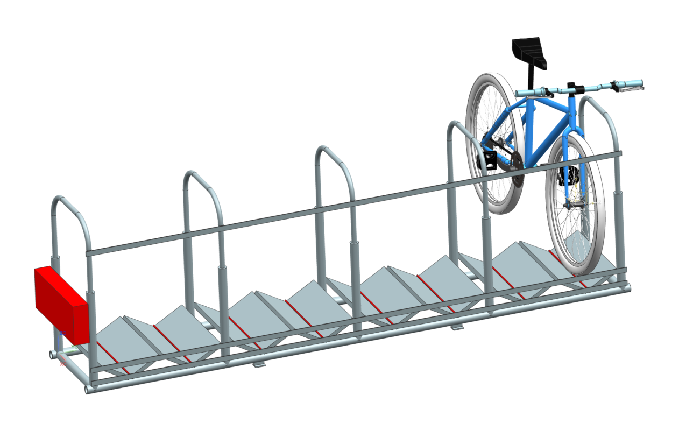
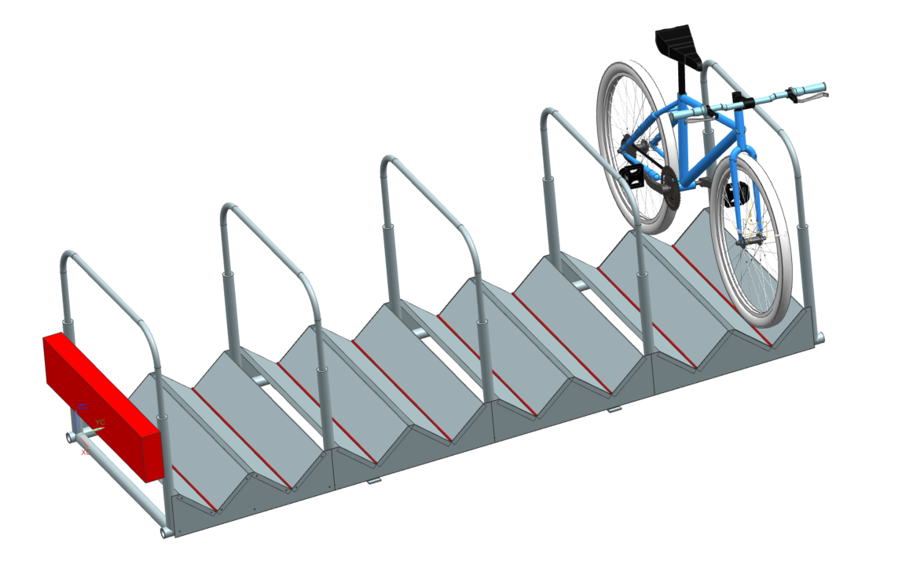

# CAD + Technische Zeichnungen

## V1

Im Folgenden ist das CAD-Modell der 1. Version dargestellt. Die Druckschaltleisten in der Mitte der Gitterroste und die Sensorplatte sind in rot dargestellt, wobei die Sensorplatte nur durch eine Blackbox ersetzt ist. Der genaue Aufbau und die Verschaltung der Sensorik ist link:..[hier] beschrieben.

Die Technische Zeichnung (TZ) dazu ist link:TZ_V1_ZSB_Fahrradständer.pdf[hier] zu finden. Die Stützgabeln und die Kabelbinder, wie in der link:..[Gerätebeschreibung] zu sehen, sind im CAD-Modell und in der TZ nicht enthalten. Sie wurden erst beim Aufbau zur zusätzlichen Stabilisierung der Gitterroste hinzugefügt.

## V2

Im Folgenden ist das CAD-Modell der 2. Version dargestellt. Die Druckschaltleisten in der Mitte der Gitterroste und die Sensorplatte sind in rot dargestellt, wobei die Sensorplatte nur durch eine Blackbox ersetzt ist. Der genaue Aufbau und die Verschaltung der Sensorik ist link:..[hier] beschrieben.

Die Technische Zeichnung (TZ) dazu ist link:TZ_V2_ZSB_Fahrradständer.pdf[hier] zu finden. Im Unterschied zu V1 werden in V2 keine Alu-Flachstangen, Stützgabeln und Kabelbinder zur Stabilisierung der Gitterroste verwendet, sondern link:TZ_Alu_Blech_V2_Fahrradständer.pdf[Alu-Bleche]. Ein weiterer Unterschied ist die größere Tiefe des Bügelständers als Optimierung, damit Fahrräder auch mit dem Rahmen an den Bügeln angeschlossen werden können.

- *link:../Aufbau+Inbetriebnahme[Aufbau + Inbetriebnahme]*
- *link:../LoRa-Boxen[LoRa-Boxen]*
