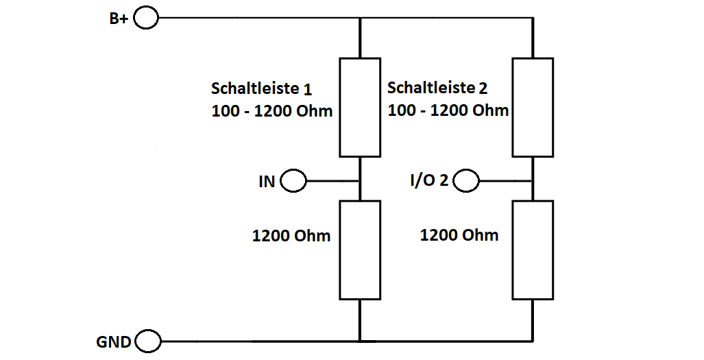
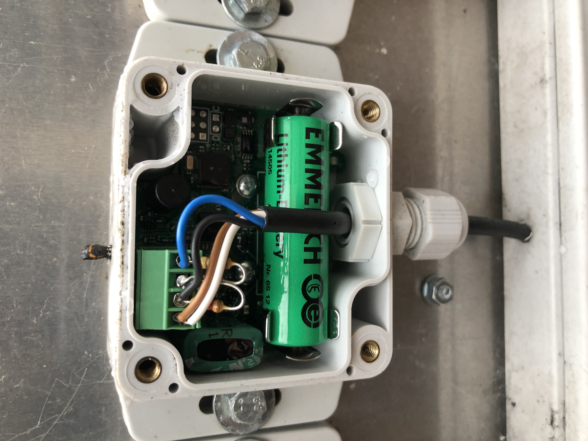

# LoRa-Boxen

Es werden die link:Elsys_ELT2/README.adoc[ELT 2 Boxen] von Elsys verwendet. Die Boxen werden so konfiguriert, dass sie in regelmäßigen Abständen
die Batteriespannung und zwei Analogwerte senden.

Ein gesendeter Wert kann damit zum Beispiel *0x070E45080000180DA3* sein. Die Zahlen 0x07; 0x08; 0x18 sind identifier um zu erkennen welcher Wert was anzeigt. Die Zahlen nach diesen Werten sind die jeweiligen Werte zu den identifiern

* 0x07 *->* Batteriespannung
* 0x08 *->* Analog 1
* 0x18 *->* Analog 2

## Schaltung

Die Schaltleisten haben im offenen (nicht gedrückten) Zustand einen Widerstand von ca. 1200 Ohm, im gedrückten Zustand ist der Widerstand ca. 100 Ohm.
Am Pin B+ der Boxen liegt, wenn eine "External startup time" über 0 eingestellt ist, für die eingestellte Zeit eine Spannung von 3-3,6V (laut Datenblatt) an. Um die Widerstandswerte der Schaltleisten zu messen werden zwei Spannungsteiler verwendet. Die Schaltung ist auf dem folgenden Bild dargestellt.

Die Schaltleisten werden so verschalten, dass im Falle eines Kabelbruchs, bei dem der Widerstand unendlich wird, die Analogaufnehmer In und I/O-2 auf GND gezogen werden.
Damit lassen sich später in Grafana Beschädigungen erkennen. Als Widerstände für den Spannungsteiler werden zwei Widerstände mit 1200 Ohm gewählt.

Im gedrückten Zustand wird damit eine Spannung von *3,3 V* gemessen. Das Widerstandsverhältnis beträgt 1200 Ohm/1300 Ohm also 0,92. +
Im nicht gedrückten Zustand wird damit eine Spannung von *1,8 V* gemessen. Das Widerstandsverhältnis beträgt 1200 Ohm/2400 Ohm also 0,5. +

Die Schaltleisten werden mit Vieradrigen Kabeln verbunden, die zu den LoRa-Boxen führen. Dabei werden die Kabel wie folgend dargestellt verbunden:

|===
|Sensorkabel |Vieradriges Kabel

|Rot Schaltleiste 1
|braun

|Schwarz Schaltleiste 1
|schwarz

|Rot Schaltleiste 2
|weiß

|Schwarz Schaltleiste 2
|blau
|===

Die Messdatenverarbeitung, Auswertung und Visualisierung findet im link:../../Backend[Backend] statt.

- *link:../Aufbau+Inbetriebnahme[Aufbau + Inbetriebnahme]*
- *link:../CAD+TechnischeZeichnungen[CAD + Technische Zeichnungen]*
- *link:../[Prototyp]*

