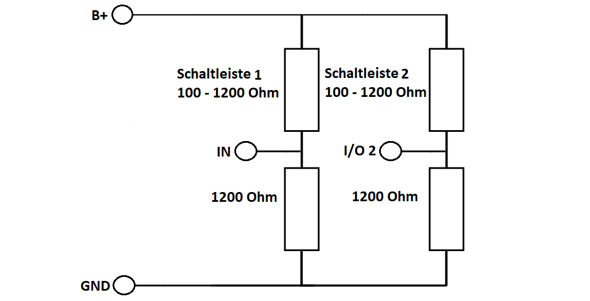

# LoRa-Boxen

Es werden die link:/Elsys_ELT2/README.adoc[ELT 2 Boxen] von Elsys verwendet. Die Boxen werden so konfiguriert, dass sie in regelmäßigen Abständen
die Batteriespannung und zwei Analogwerte senden.

Ein gesendeter Wert kann damit zum Beispiel *0x070E45080000180DA3* sein. Die Zahlen 0x07; 0x08; 0x18 sind identifier um zu erkennen welcher Wert was anzeigt. Die Zahlen nach diesen Werten sind die jeweiligen Werte zu den identifiern

* 0x07 *->* Batteriespannung
* 0x08 *->* Analog 1
* 0x18 *->* Analog 2

## Schaltung

Die Schaltleisten haben im offenen (nicht gedrückten) Zustand einen Widerstand von ca. 1200 Ohm, im gedrückten Zustand ist der Widerstand ca. 100 Ohm.
Am Pin B+ der Boxen liegt, wenn eine "External startup time" über 0 eingestellt ist, für die eingestellte Zeit eine Spannung von 3-3,6V (laut Datenblatt) an. Um die Widerstandswerte der Schaltleisten zu messen werden zwei Spannungsteiler verwendet. Die Schaltung ist auf dem folgenden Bild dargestellt.

Die Schaltleisten werden so verschalten, dass im Falle eines Kabelbruchs, bei dem der Widerstand unendlich wird, die Analogaufnehmer In und I/O-2 auf GND gezogen werden.
Damit lassen sich später in Grafana Beschädigungen erkennen. Als Widerstände für den Spannungsteiler werden zwei Widerstände mit 1200 Ohm gewählt.

Im gedrückten Zustand wird damit eine Spannung von *3,3 V* gemessen. Das Widerstandsverhältnis beträgt 1200 Ohm/1300 Ohm also 0,92. +
Im nicht gedrückten Zustand wird damit eine Spannung von *1,8 V* gemessen. Das Widerstandsverhältnis beträgt 1200 Ohm/2400 Ohm also 0,5. +

Die Schaltleisten werden mit Vieradrigen Kabeln verbunden, die zu den LoRa-Boxen führen. Dabei werden die Kabel wie folgend dargestellt verbunden:

|===
|Sensorkabel |Vieradriges Kabel

|Rot Schaltleiste 1
|braun

|Schwarz Schaltleiste 1
|schwarz

|Rot Schaltleiste 2
|weiß

|Schwarz Schaltleiste 2
|blau
|===

## Auswertung

Es werden insgesamt vier Boxen verwendet, die jeweils zwei Analogeingänge besitzen. Damit lassen sich 8 Stellplätze abdecken. Zur Auswertung senden die Boxen 2 - 4 in Node Red ihre Daten an die erste Box, die diese dann weiterverarbeitet. Die Boxen sind Nummeriert und besitzen jeweils einen Analogeingang 1 und 2. Es wird immer von links nach rechts gezählt. Das heißt LoRa-Box 1 ist ganz links und 4 ganz rechts. Schaltleiste 1 ist immer auf der linken Seite des Abteils, 2 auf der rechten. Wie bei den anderen Sensoren werden die Daten vom TTN über Node Red zu einer Datenbank geschickt und dort gespeichert. Im Sensor Config Frontend werden JSON-Files angelegt in denen festgelegt wird, welche Daten von Node Red zur Datenbank gesendet werden. Der Unterschied zu den anderen Sensoren ist in diesem Fall, dass die Daten in Node Red nicht einfach nur weitergesendet werden sondern auch ausgewertet werden. Da in den JSON-Files angegeben werden muss, wo die zu Speichernden Daten aus dem vom TTN gesendeten Array genommen werden sollen, dies aber in diesem Fall nicht gebraucht wird, werden für "offset_bytes" und "length_bytes" bei den fields "Fahrradzahl", "Fehler_Analog1", "Fehler_Analog2", "Stellplatz1" und "Stellplatz2" nur Dummy Werte ohne Bedeutung eingesetzt.

|===
|field |Inhalt

|Fahrradzahl
|Beinhaltet die Anzahl der im Moment abgestellten Fahrräder. Diese Variable gibt es nur im JSON File von der ersten Sensor Box, da die anderen drei Boxen ihre Daten an die erste Box schicken, die diese dann zusammenrechnet.

|Fehler Analog 1 & 2
|Diesen Wert gibt es bei allen JSON-Files. Der Wert gibt an ob der zugehörige Stellplatz (1 oder 2) fehlerhaft ist. Dabei wird vor allem ein Kabelbruch erkannt. 0 bedeuted es gibt keinen Fehler, 1 bedeutet ein Fehler liegt vor

|Stellplatz 1 & 2
|Dieser Wert den es jeweils für beide Stellplätze gibt zeigt an, ob ein Stellplatz besetzt ist. 1 heißt besetzt, 0 heißt frei.
|===

Es gibt zwei verschiedene Auswertungscodes bei der Auswertung von der Box fahrradstaender1 werden die Werte der einzelnen Boxen zu der gesamten Fahrradzahl zusammengerechnet. Die Codes von fahrradstaender2-4 entsprechen dem von fahrradstaender1 ohne das Errechnen der gesamten Fahrradzahl.
Die beiden JSON Files für die Hauptbox (fahrradstaender1) und die anderen Boxen (fahrradstaender2-4) sind hier gespeichert.

* link:JSON_fahrradstaender1.txt[fahrradstaender1]
* link:JSON_fahrradstaender2.txt[fahrradstaender2-4]

**Wichtig: wenn man etwas an den JSON-Files ändert, bzw. allgemein im Sensor Config Frontend ändert und deployed wird der zugehörige Flow in Node RED mit dem standart Flow überschrieben. Deshalb sollte man vor dem deployen den Programmcode bzw. den Flow zwischenspeichern.**

Die Codes für die Payloadfunktionen in Node RED sind unter link:Programmcode_fahrradstaender1.txt[fahrradstaender1], link:Programmcode_fahrradstaender2.txt[fahrradstaender2] und link:Programmcode_fahrradstaender34.txt[fahrradstaender34] gespeichert. Beim Code von Fahrradständer 1 und 2 sind die Analogeingänge zu 3 und 4 vertauscht, da dort die Verkabelung vertauscht ist. In link:Programmcode_fahrradstaender1.txt[Programmcode fahrradstaender1] ist auch der Code dokumentiert, dieser unterscheidet sich nicht zu den anderen, außer dass diese die Funktion zum Zusammenrechnen aller Stellplätze nicht besitzen.
