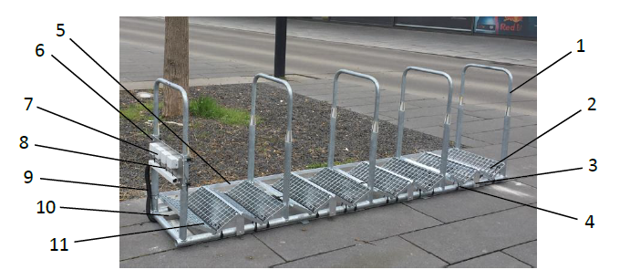

# Prototyp

Es gibt zwei Versionen des Prototyps: Version 1 (V1) und Version 2 (V2). Bisher wurde nur V1 aufgebaut und im Reallabor eingesetzt. V2 ist eine optimierte Version von V1 und unterscheidet sich im Wesentlichen konstruktiv. Die Sensorik und Datenverarbeitung sind gleich. Der Aufbau und Einsatz von V2 ist bisher nur in Planung. Die folgende Gerätebeschreibung und Technischen Daten beziehen sich auf V1.

## Gerätebeschreibung

### Abgebildete Komponenten

1. Bügel-Fahrradständer
2. Gitterroste
3. Stützgabel
4. Kabelbinder
5. Flachstange
6. Sensorplatte
7. ELT-2 LoRa-Box
8. Verlängerungsleitung (vieradrig)
9. Kabelschutzschlauch
10. Kabelkanal
11. Mayser EKS 011 Miniaturdruckschaltleiste

## Technische Daten

.Bügelständer
[cols="1,3"]
|===
|Abmessungen
|2772 x 510 x 903 mm (Bügelabstand: 630 mm)
|===

.LoRa-Boxen (Elsys ELT-2)
[cols="1,3"]
|===
|Batterietyp
|4 x 3,6 V AA Lithium Batterie

|Batterie Lebensdauer
|< 10 Jahre (Je nach Konfiguration und Umgebungstemperatur)

|Abtastrate
|3 min. (Einstellbar über NFC-App und Downlink Konfiguration)

|Wireless Technologie
|LoRaWAN 1.0.3

|Wireless Sicherheit
|End-to-End Verschlüsselung (AES-CTR), Data Integrity Protection (AES-CMAC)

|Frequenz
|EU: 863 - 870 Hz (Weitere möglich)

|Einsatztemperatur
|-40 bis +60 °C

|Schutzart
|IP67
|===

.Miniaturdruckschaltleisten (Mayser EKS 011)
[cols="1,3"]
|===
|Signalgeber-Länge
|500 mm

|Abschlusswiderstand
|1,2 k&#x2126;  &#177; 1 %

|Schaltkraft
|< 15 N (23 °C), < 30 N (-25 °C)

|Leistung
|max. 250 mW

|Spannung
|max. 24 V DC

|Einsatztemperatur
|-25 bis +80 °C

|Schutzart
|IP65
|===

