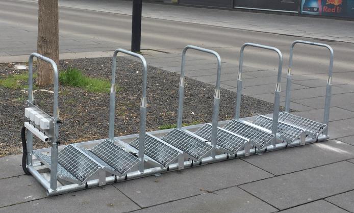

# Fahrradständer

Im Rahmen des Projekts _Zukunftsstadt Ulm_ soll ein Netz aus flexibel aufstellbarer, eigenständiger und sichtbarer Sensorik zur Erhebung von Mobilitätsdaten aufgebaut werden. In Zusammenarbeit mit den Bürger:Innen soll dadurch ein Impuls für eine zukünftige Infrastruktur zur Datenerhebung geschaffen werden. Die von den Sensoren erfassten und anonymisierten Mobilitätsdaten sollen am Ende über die Datenplattform der Stadt Ulm für eine nachhaltige und agile Stadtplanung weiteren Nutzern zur Verfügung stehen. Die Technische Hochschule Ulm (THU) setzt das Projekt als Kooperationspartner im Themenfeld Mobilität wissenschaftlich um.

Es wurde der link:Prototyp[Prototyp] eines mobilen Fahrradständers entwickelt, der mithilfe von sensorgestützter Technik abgestellte Fahrräder zählt und auswertet. Der Fahrradständer kann im öffentlich genutzten Stadtraum positioniert werden und ist frei für Fahrradfahrer:innen zugänglich. Elektrisch autarke LoRa-Boxen sind in der Lage gemessene Daten per Funktechnologie über das LoRaWAN-Netzwerk zu versenden. Auf der Grundlage von Messdaten sollen in Zukunft potentielle Fahrradstellplätze in der Stadt intelligent evaluiert werden, sodass die Entscheidung in der Stadtplanung für sinnvolle Standorte erleichtert wird. 

Der link:Prototyp[Prototyp] basiert auf einem klassischen Bügelständer, der für den Anwendungsfall etwas modifiziert wurde. Druckschaltsensoren sind auf Gitterrosten befestigt, die in Form eines „W“ angeordnet sind. Wenn Fahrräder mit ihren Vorderrädern auf den Sensoren stehen wird eine Spannungsänderung erzeugt, die von Funkboxen detektiert und über das quelloffene Funknetzwerk LoRaWAN an ein link:Backend[Backend] versendet wird.

Dieses Repository soll eine transparente technische Dokumentation bieten. [red]#*ACHTUNG:  Alle, die diesen Prototypen nachbauen, sind als Hersteller selbst verantwortlich. Bei Inverkehrbringung muss sicher gestellt werden, dass alle geltenden EU-Richtlinien eingehalten werden und eine CE-Kennzeichnung angebracht wird. Die THU haftet nicht für die Herstellung und Inverkehrbringung anderer.*#

- *link:Prototyp[Prototyp]* +
- *link:Backend[Backend]* +